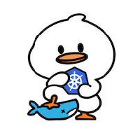

## About " nearg1e " 

[🐈 每周更新猫片](https://github.com/neargle/neargle/blob/main/cat.md) | [🐮 推荐一些技术社群](https://github.com/neargle/neargle/blob/main/top-recs-zsxq.md)

### 📊 实时数据 | REAL-TIME DATA

 

### 📣 会议分享 | SPOKEN AT CONFERENCES, AFTER 2020 

|[Security Conference](https://github.com/neargle/my-re0-k8s-security/tree/main/slide)|CNCF & Linux Foundation|
|-|-|
|   ||
|HITB、 BlackHat、 WHC、CIS ...|Kubecon & CloudNativeCon ...|

 

 <b> 🌱 More </b> 

<!-- &nbsp;    -->

### 🤲 目前开源精力 | CONTRIBUTED AT OPEN SOURCE COMMUNITY RECENTLY

  <b>主研和持续维护 <a href="https://github.com/cdk-team/CDK">CDK</a></b>：一款可爱、持续迭代的容器和Kubernetes安全工具

  <b><a href="https://github.com/opensec-cn">OPENSEC TEAM </a>成员</b>：五个可爱、强大、富有创造力的小伙伴（现在老了）

***🔎 NOTE :** 部分主研的开源项目目前已 ARCHIVED*

<!-- more ends -->

<!-- 

 -->

<!--
**neargle/neargle** is a ✨ _special_ ✨ repository because its `README.md` (this file) appears on your GitHub profile.

Here are some ideas to get you started:

- 🔭 I’m currently working on ...
- 🌱 I’m currently learning ...
- 👯 I’m looking to collaborate on ...
- 🤔 I’m looking for help with ...
- 💬 Ask me about ...
- 📫 How to reach me: ...
- 😄 Pronouns: ...
- ⚡ Fun fact: ...
-->

<!-- 其他内容 -->
