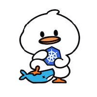
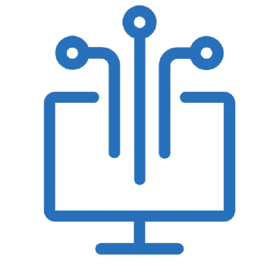

## nearg1e &nbsp;

---

### 🤔 近期相册 | Recent Photos

### 📣 会议分享 | Spoken at Conferences (2020+)

| [Security Conferences](https://github.com/neargle/my-re0-k8s-security/tree/main/slide) | CNCF & Linux Foundation |
|:-:|:-:|
|     |  |
| HITB、BlackHat、WHC、CIS … | KubeCon & CloudNativeCon … |

<b>🌱 More</b>

### 🤲 开源贡献 | Open Source

 <b>主研和持续维护 <a href="https://github.com/cdk-team/CDK">CDK</a></b>：一款持续迭代的容器和 Kubernetes 安全工具

 <b><a href="https://github.com/opensec-cn">OPENSEC TEAM</a> 成员</b>：五个可爱、强大、富有创造力的小伙伴

> *🔎 部分主研的开源项目目前已 ARCHIVED*

---

[🐈 猫片周更](https://github.com/neargle/neargle/blob/main/cat.md) &nbsp;·&nbsp; [🐮 推荐技术社群](https://github.com/neargle/neargle/blob/main/top-recs-zsxq.md)
