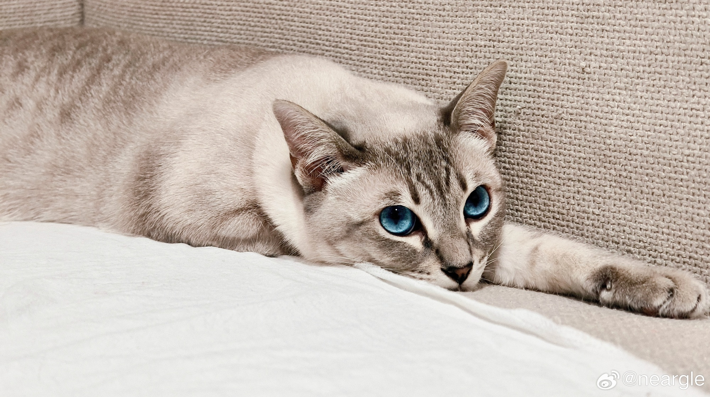
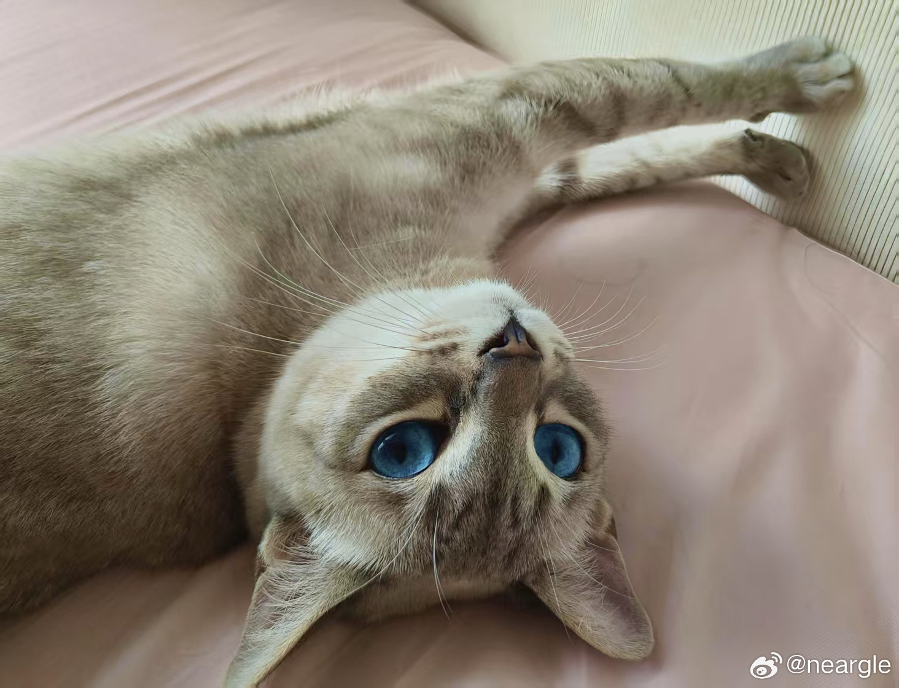
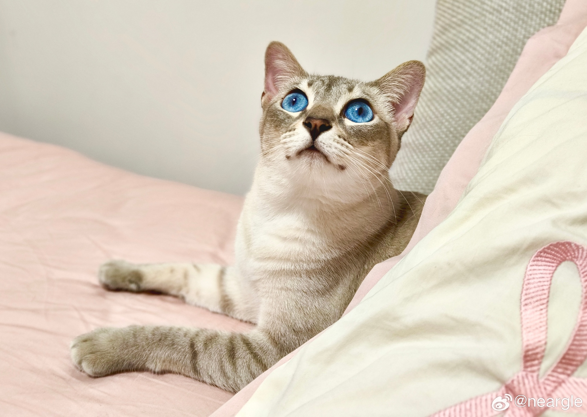
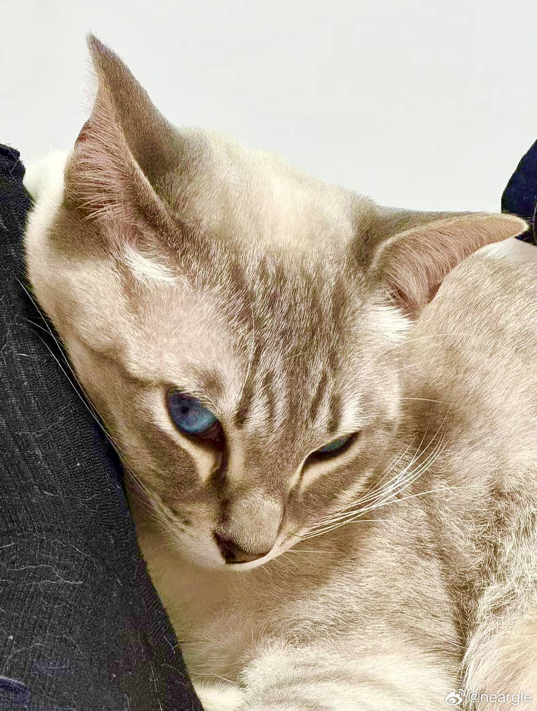

#  猫咪画廊

## 小猫资料

- 🐈 俺的名字：fufu，女孩子，祖籍泰国，是一只 _**淡蓝**色 **虎**斑 **暹**罗_ 猫（以上都是细分品种名🤣）。   
- 🗓 生辰八字：6月15日出生，属兔，猫妈妈这一胎就她一只。两岁十斤，正在成长为胖狸花猫的路上（暹罗特性：变黑🤦‍♀️）。
- ♾️ 每周更新小猫的短链接： http://mhz.pw/Eve

## 小猫证件照
</img>

## 本周更新

</img>

## 历史存档

### 三岁的时候

</img>
</img>
</img>

### 两岁的时候

</img>

</img>

</img>

</img>

</img>
</img>

</img>
</img>
</img>

</img> 
</img> 
</img> 

</img> 
</img> 
</img> 

### 一岁的时候

</img> 
</img> 
</img> 

